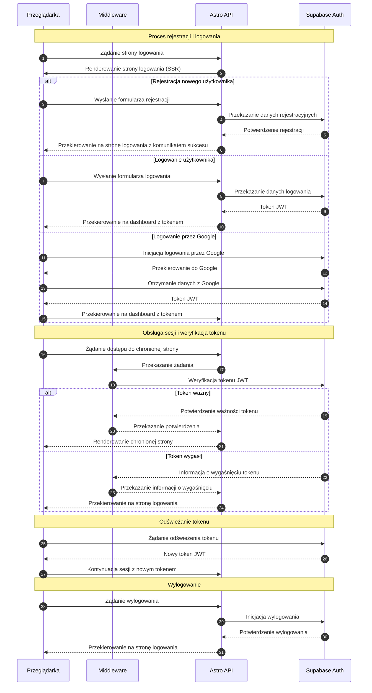

```mermaid
sequenceDiagram
    autonumber
    participant Browser as Przeglądarka
    participant Middleware as Middleware
    participant AstroAPI as Astro API
    participant SupabaseAuth as Supabase Auth

    Note over Browser,SupabaseAuth: Proces rejestracji i logowania

    Browser->>AstroAPI: Żądanie strony logowania
    AstroAPI->>Browser: Renderowanie strony logowania (SSR)

    alt Rejestracja nowego użytkownika
        Browser->>AstroAPI: Wysłanie formularza rejestracji
        AstroAPI->>SupabaseAuth: Przekazanie danych rejestracyjnych
        SupabaseAuth-->>AstroAPI: Potwierdzenie rejestracji
        AstroAPI-->>Browser: Przekierowanie na stronę logowania z komunikatem sukcesu
    else Logowanie użytkownika
        Browser->>AstroAPI: Wysłanie formularza logowania
        AstroAPI->>SupabaseAuth: Przekazanie danych logowania
        SupabaseAuth-->>AstroAPI: Token JWT
        AstroAPI-->>Browser: Przekierowanie na dashboard z tokenem
    else Logowanie przez Google
        Browser->>SupabaseAuth: Inicjacja logowania przez Google
        SupabaseAuth-->>Browser: Przekierowanie do Google
        Browser->>SupabaseAuth: Otrzymanie danych z Google
        SupabaseAuth-->>Browser: Token JWT
        Browser->>AstroAPI: Przekierowanie na dashboard z tokenem
    end

    Note over Browser,SupabaseAuth: Obsługa sesji i weryfikacja tokenu

    Browser->>AstroAPI: Żądanie dostępu do chronionej strony
    AstroAPI->>Middleware: Przekazanie żądania
    Middleware->>SupabaseAuth: Weryfikacja tokenu JWT
    alt Token ważny
        SupabaseAuth-->>Middleware: Potwierdzenie ważności tokenu
        Middleware-->>AstroAPI: Przekazanie potwierdzenia
        AstroAPI-->>Browser: Renderowanie chronionej strony
    else Token wygasł
        SupabaseAuth-->>Middleware: Informacja o wygaśnięciu tokenu
        Middleware-->>AstroAPI: Przekazanie informacji o wygaśnięciu
        AstroAPI-->>Browser: Przekierowanie na stronę logowania
    end

    Note over Browser,SupabaseAuth: Odświeżanie tokenu

    Browser->>SupabaseAuth: Żądanie odświeżenia tokenu
    SupabaseAuth-->>Browser: Nowy token JWT
    Browser->>AstroAPI: Kontynuacja sesji z nowym tokenem

    Note over Browser,SupabaseAuth: Wylogowanie

    Browser->>AstroAPI: Żądanie wylogowania
    AstroAPI->>SupabaseAuth: Inicjacja wylogowania
    SupabaseAuth-->>AstroAPI: Potwierdzenie wylogowania
    AstroAPI-->>Browser: Przekierowanie na stronę logowania
```
